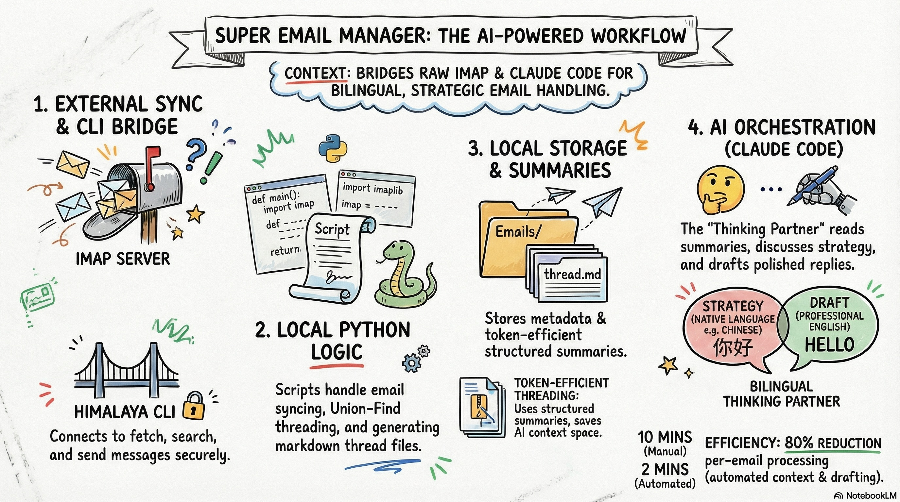
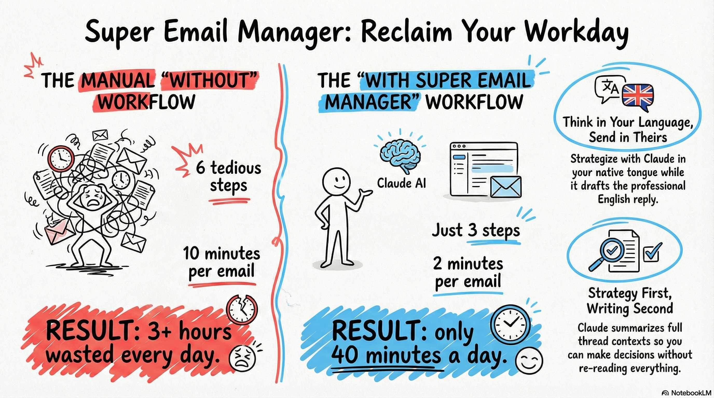
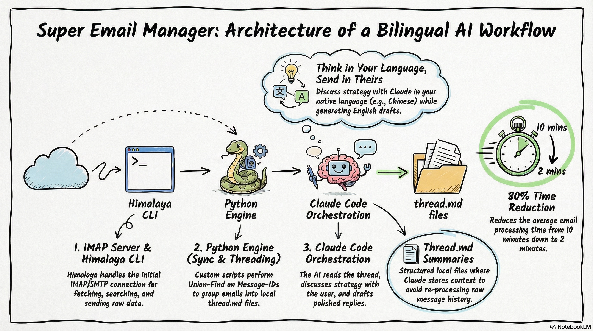

# Super Email Skill

<p align="center">
  
</p>

**TL;DR** — Makes AI your email colleague.

1. **Discuss before drafting** — Claude reads the full thread, talks strategy with you, then writes. Not autocomplete.
2. **Structured summaries** — every thread gets a markdown summary. Claude reads that, not fifty raw messages. Put it in git and `git diff` = automatic work reports.
3. **Bilingual workflow** — think in your language, send in theirs. Strategy in Chinese, reply in English.

---

I handle all customer emails myself -- support tickets, partnership inquiries, onboarding issues, feature requests -- while also running the product. English is my second language. Every reply used to mean re-reading the full thread, figuring out the right move, drafting something professional, and double-checking tone. Five to ten minutes per email, dozens of times a day.

This tool is how I keep up. It plugs into [Claude Code](https://docs.anthropic.com/en/docs/claude-code) and turns email into a conversation: Claude reads the full thread, discusses strategy with me, then sends a polished reply -- only when I say "send."

## The Solution

```
You:    "Check my email"
Claude: [scans inbox, lists 8 new messages with summaries]

You:    "Reply to Sarah's email about the API integration issue"
Claude: [reads the full 6-message thread, then responds in your language]

        "Sarah's core issue is that webhook validation fails because
         her platform sends GET requests but we only support POST.
         I suggest we recommend the middleware bridge approach -- I can
         include a code example. Want me to also mention the upcoming
         native GET support in Q2?"

You:    "Yes, and add the setup guide link"
Claude: [drafts English reply, shows you the full email]

You:    "Send"
Claude: [sends with proper threading headers, CC, and HTML signature]
```

**That's 2 minutes instead of 10.** And the reply quality is better because Claude has the full context.

<p align="center">
  
</p>

## What Makes This Different

- **Full thread context** -- Claude reads the entire conversation history before suggesting anything. It knows what was promised three emails ago.
- **Strategy first, writing second** -- discusses the approach with you before drafting a single word. You make the decisions; Claude handles the execution.
- **You stay in control** -- nothing sends without your explicit approval. Every draft is shown to you first.
- **Summaries keep things fast** -- every thread gets a structured summary so Claude reads that instead of replaying fifty raw messages.
- **Smart threading** -- groups emails into conversations automatically. Replies land in the right thread in any email client.
- **Selective sync** -- only archive the threads you're actively working on.
- **Configurable signatures** -- closing, name block, and logo/branding via `config.toml`.

## Think in Your Language, Send in Theirs

When I open a thread, Claude talks through the situation with me in Chinese -- what the customer actually wants, what our options are, what tone to strike. Then it drafts the reply in professional English. The strategic thinking happens in the language I think fastest in. The output arrives in the language the customer expects.

This isn't a translation feature. It's a bilingual working relationship. You discuss, decide, then send -- all without switching mental gears.

## Git as Your Work Log

Put your `Emails/` directory in its own git repo. Commit periodically -- daily, weekly, whatever fits. Now you have something most people don't: a version-controlled record of every customer interaction, with structured summaries.

```bash
# What did I handle this week?
git diff HEAD~7 --stat

# Let Claude summarize it
"Summarize my email activity this week based on the git diff"
```

Claude reads the diff -- new threads created, summaries updated, replies sent -- and gives you a work report. No manual tracking. No time-logging tools. Your email workflow *is* the log.

This turns email from a black hole into an auditable, searchable, AI-readable archive that compounds over time.

## Getting Started

```
/plugin marketplace add HynLcc/super-email-skill
/plugin install super-email@super-email-skill
```

Or manually:

```bash
git clone https://github.com/HynLcc/super-email-skill.git
cp -r super-email-skill/skills/super-email ~/.claude/skills/super-email
cd ~/.claude/skills/super-email
cp config.example.toml config.toml
```

Then open Claude Code and say: **"Help me set up the email skill and configure Himalaya."**

Claude handles the rest -- installing [Himalaya CLI](https://github.com/pimalaya/himalaya), configuring your IMAP/SMTP account, and editing `config.toml`. You just answer its questions.

When it's done, say **"check my email"** and you're live.

## How It Works

<p align="center">
  
</p>

1. **Himalaya CLI** handles email fetching and sending via IMAP/SMTP
2. **sync_emails.py** downloads emails, groups them into conversation threads, and generates `thread.md` files with metadata and summaries
3. **send_email.py** builds HTML emails with configurable signatures and proper threading headers so replies thread correctly everywhere
4. **Claude Code** orchestrates everything -- you just talk to it

The summaries are where the token efficiency lives. After each interaction, Claude writes a structured summary at the top of the thread file. Next time it needs context on that thread, it reads the summary instead of re-processing every message. As your archive grows to hundreds of threads, this is the difference between burning through context and staying responsive.

## Real-World Workflow

This is the file structure after a few days of use:

```
Emails/
├── sarah_api-integration-issue/
│   ├── thread.md            # Full conversation + summary
│   ├── raw/                 # Original EML files
│   └── attachments/
├── james_onboarding-activation-error/
│   ├── thread.md
│   └── raw/
├── maria_partnership-proposal/
│   └── ...
└── .sync_state.json          # Tracks what's been synced
```

Each `thread.md` contains structured metadata and a running summary:

```markdown
---
subject: "Re: API Integration Issue"
from: "Sarah <sarah@example.com>"
participants:
  - sarah@example.com
  - you@example.com
started: "2025-03-20"
last_date: "2025-03-25"
message_count: 6
status: ongoing
---

## Summary

Sarah reported webhook validation failures with her platform's GET requests.
We recommended the middleware bridge approach with a code example.
She confirmed it works but asked about native GET support timeline.
Latest: we shared the Q2 roadmap link and offered to help with edge cases.

---

## Email 1 — Sarah (2025-03-20 09:15)

> Hi, I'm trying to integrate your webhooks with our platform but...
```

The `## Summary` section is written by Claude after each reply. When you finish handling a thread -- send a reply, resolve an issue -- Claude distills the full conversation into a few lines: who initiated, what the core problem was, what was decided, and the current status. Next time you (or Claude) revisit this thread, the summary is all that's needed to pick up where you left off. No re-reading fifty messages.

## Prerequisites

- **Python 3.11+** (uses `tomllib`; for 3.10, install `tomli`)
- **[Himalaya CLI](https://github.com/pimalaya/himalaya)** -- handles IMAP/SMTP
- **[Claude Code](https://docs.anthropic.com/en/docs/claude-code)** -- the AI assistant that runs this skill
